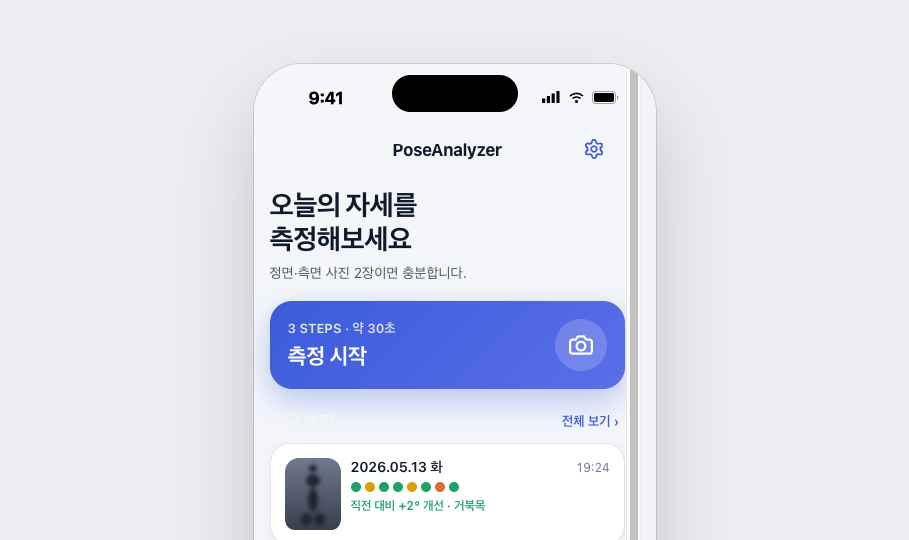

# PoseAnalyzer

> 정면·측면 사진 2장을 Apple Vision으로 분석하여 8가지 자세 문제를 자동 판정하고, 시간에 따른 변화 추이를 추적하는 iOS 앱.

<p align="center">
  
</p>

---

## 📋 주요 기능

- **2장 사진 분석**: 정면 + 측면 사진을 한 번에 입력
- **8가지 자세 자동 판정**: 거북목 · 라운드숄더 · 흉추 후만증 · 골반 전방경사 · 무릎 과신전 · 척추측만 · 머리 좌우 기울기 · 무릎 X자/O자
- **커스텀 카메라**: AVCaptureSession 기반, 자세 가이드 실루엣 오버레이
- **관절 시각화**: Vision으로 추출한 관절 좌표를 결과 화면 사진 위에 점·선으로 오버레이
- **좌우 비대칭 분석**: 어깨/골반 좌우 높이차 (키 입력 시 cm 단위)
- **직전 대비 변화 추적**: 측정 결과의 시간에 따른 변화량 표시
- **추이 그래프**: 자세별 시간축 그래프 (Swift Charts)
- **라이트/다크모드 1급 지원**
- **브랜드 일관성**: 인디고 그라디언트 스플래시, 정렬 컬럼 모티프 앱 아이콘

---

## 🛠 기술 스택

### 언어 / 플랫폼
- **Swift** 5.9+
- **SwiftUI** (선언형 UI)
- **iOS 17.0+** (Xcode 16+ 권장)

### 사용 프레임워크 (모두 Apple 표준, 외부 라이브러리 0개)

| 프레임워크 | 용도 |
|------------|------|
| **Vision** | 인체 관절 자동 인식 (`VNDetectHumanBodyPoseRequest`) |
| **AVFoundation** | 커스텀 카메라 세션 (`AVCaptureSession`, `AVCapturePhotoOutput`) |
| **SwiftData** | 로컬 저장 (측정 기록, 사용자 프로필) |
| **Swift Charts** | 추이 그래프 (iOS 16+) |
| **SwiftUI Canvas** | 관절 점·선 오버레이, 브랜드 마크 |
| **PhotosUI** | 사진 라이브러리 선택 (`PhotosPicker`) |
| **UIKit** | `UIImagePickerController` 대안, 권한 처리 |
| **Observation** | `@Observable` 기반 ViewModel |

> **외부 의존성 0개** — CocoaPods, SPM 외부 패키지 미사용. Apple 표준 프레임워크만으로 구현.

---

## 🏗 아키텍처

**MVVM + 프로토콜 기반 분석 도메인** (B+ 패턴)

```
┌──────────────────────────────────────┐
│  Presentation (SwiftUI Views)        │
│  View ↔ ViewModel (@Observable)      │
└──────────────────────────────────────┘
              ↓ 호출
┌──────────────────────────────────────┐
│  UseCase                             │
│  AnalyzeSessionUseCase               │
└──────────────────────────────────────┘
              ↓ 프로토콜만 의존
┌──────────────────────────────────────┐
│  Domain Protocols                    │
│  PoseDetector / PostureEvaluator /   │
│  AsymmetryAnalyzer / MotionAnalyzer  │
└──────────────────────────────────────┘
              ↑ 구현체 주입
┌──────────────────────────────────────┐
│  Implementations                     │
│  VisionPoseDetector,                 │
│  8 PostureEvaluators,                │
│  DefaultAsymmetryAnalyzer            │
└──────────────────────────────────────┘
              ↓ 저장
┌──────────────────────────────────────┐
│  Data Layer                          │
│  SessionRepository, ImageStore,      │
│  UserProfileRepository (SwiftData)   │
└──────────────────────────────────────┘
```

### 핵심 설계 원칙
1. **단방향 의존성**: View → UseCase → Protocol ← 구현체. View는 구현체에 의존하지 않음.
2. **프로토콜 기반 확장**: 새 자세 추가 = `PostureEvaluator` 구현체 하나 추가. Vision 교체 = `PoseDetector` 구현체 하나 교체.
3. **2차 영상 분석 대비**: `MotionAnalyzer` 프로토콜만 정의 (스쿼트/러닝 등 향후 추가).
4. **DI 컨테이너**: `AppDependencies`에서 모든 인스턴스 wiring, SwiftUI Environment로 주입.

---

## 📂 폴더 구조

```
PoseAnalyzer/
├── App/
│   ├── PoseAnalyzerApp.swift          # 앱 진입점 (LaunchView → AppTabView)
│   └── AppDependencies.swift          # DI 컨테이너
│
├── Domain/                            # 핵심 도메인 (UI 무관)
│   ├── Models/                        # PoseFrame, PostureResult, SessionReport 등
│   ├── Detection/                     # PoseDetector 프로토콜 + VisionPoseDetector
│   ├── Evaluation/                    # PostureEvaluator 프로토콜 + 8개 구현체
│   ├── Asymmetry/                     # AsymmetryAnalyzer
│   ├── Motion/                        # 2차 영상 분석 (인터페이스만)
│   └── UseCase/                       # AnalyzeSessionUseCase
│
├── Data/
│   ├── SwiftData/                     # @Model: UserProfile, SessionRecord, PostureRecord
│   ├── ImageStore.swift               # 사진 파일 관리
│   ├── SessionRepository.swift        # CRUD
│   └── UserProfileRepository.swift
│
├── Presentation/
│   ├── DesignSystem/                  # AppColor, AppFont, AppSpacing
│   ├── Common/Components/             # StatusBadge, AppButton, AppCard, AppToast 등
│   ├── Home/                          # HomeView + HomeViewModel
│   ├── Measurement/                   # MeasurementWizardView (3-step) + ViewModel
│   │   ├── CameraSessionManager.swift # AVCaptureSession 관리
│   │   ├── CameraPreviewView.swift    # AVCaptureVideoPreviewLayer SwiftUI 래퍼
│   │   ├── CustomCameraView.swift     # 커스텀 카메라 화면 + 셔터 + 닫기
│   │   ├── PoseGuideOverlay.swift     # 자세 가이드 실루엣 (Shape protocol)
│   │   ├── PhotoInputSheet.swift      # 카메라/라이브러리 선택 시트
│   │   ├── PhotoLibraryPicker.swift   # PhotosPicker 래퍼
│   │   ├── WizardStepView.swift       # 정면/측면 사진 입력 단계
│   │   ├── WizardHeightStepView.swift # 키 입력 단계
│   │   ├── AnalyzingView.swift        # 분석 중 (breathing pulse)
│   │   └── MeasurementWizardView.swift
│   ├── Result/                        # AnalysisResultView + PoseOverlayView
│   ├── History/                       # HistoryListView + TrendView (Swift Charts)
│   ├── Settings/                      # SettingsView
│   ├── LaunchView.swift               # 인디고 스플래시 (마크 + 워드마크)
│   └── AppTabView.swift               # 측정/기록 탭
│
├── Support/Utils/
│   ├── GeometryMath.swift             # 각도/거리/기울기 계산 (TDD)
│   └── AppPermissions.swift           # 카메라 권한 헬퍼
│
├── Assets.xcassets/
│   ├── AppIcon.appiconset/            # 9 사이즈 PNG ("Aligned column" 마크)
│   └── LaunchBackground.colorset/     # 인디고 #3B5BDB (LaunchScreen용)
│
└── LaunchScreen.storyboard            # 콜드 스타트 인디고 화면
```

---

## 🧮 자세 판정 알고리즘

각 자세는 임상 가이드라인 기준의 임계값을 사용. 모든 임계값은 `Thresholds` 구조체에 상수로 분리되어 추후 튜닝 가능.

| 자세 | 사진 | 측정 |
|------|------|------|
| 거북목 | 측면 | 귀-어깨-엉덩이 세 점 각도 |
| 라운드숄더 | 측면 | 어깨-귀 수평거리 / 어깨 폭 비율 |
| 흉추 후만증 | 측면 | 목-어깨-엉덩이 세 점 각도 |
| 골반 전방경사 | 측면 | 어깨-엉덩이-무릎 세 점 각도 |
| 무릎 과신전 | 측면 | 엉덩이-무릎-발목 각도 |
| 척추측만 | 정면 | 어깨선/엉덩이선 기울기 |
| 머리 좌우 기울기 | 정면 | 양 귀(또는 양 눈) 기울기 |
| 무릎 X자/O자 | 정면 | 양 다리 각도 |

판정 단계: **🟢 정상 / 🟡 주의 / 🟠 의심 / ⚪ 측정 불가**

---

## 📸 측정 흐름

1. **홈** → "측정 시작" CTA
2. **Step 1 / 3**: 정면 사진 — 카메라(커스텀) 또는 라이브러리
3. **Step 2 / 3**: 측면 사진
4. **Step 3 / 3**: 키 입력 (선택, 한 번 입력하면 다음에 자동 적용)
5. **분석 중**: 두 사진 병렬 Vision 호출 + 8개 자세 평가 + 비대칭 분석
6. **결과 화면**: 사진 + 관절 오버레이 + 8개 자세 카드 + 비대칭 + 직전 비교
7. **저장** → 토스트 + 자동 dismiss → 홈으로 복귀, 기록 탭에 즉시 반영

### 커스텀 카메라
- AVCaptureSession 기반 라이브 프리뷰
- 자세별 가이드 실루엣 오버레이 (정면/측면 다른 실루엣)
- STEP 배지 + 안내 텍스트
- safe area 정확히 적용된 닫기/셔터 버튼

---

## 🎨 디자인 시스템

- **브랜드 컬러**: Pose Indigo `#3B5BDB`
- **상태 컬러**: 정상 `#22A06B` · 주의 `#D9A106` · 의심 `#E0683A` · 측정 불가 `#8A94A6`
- **타입**: Pretendard (한글 iOS 표준) — 현재는 System Font fallback
- **톤**: 합니다체 (중립 관찰자 톤). "우측 어깨가 1.8cm 높음" 같은 측정 도구 톤
- **접근성**: 색만 의존하지 않고 아이콘+텍스트 병기, VoiceOver 한국어 label
- **앱 아이콘**: "Aligned column" 마크 — 머리 + 어깨 바 + 척추 컬럼 + 골반 바 + mint 정렬 도트
- **스플래시**: 인디고 그라디언트 풀블리드, 마크 + 워드마크 + 캡션

자세한 디자인 시스템 → [`docs/design/README.md`](docs/design/README.md)

디자인 핸드오프 자료:
- [`docs/design/swift/PoseGuideOverlay.swift`](docs/design/swift/) — 카메라 가이드 디자인 원본
- [`docs/design/exports/`](docs/design/exports/) — 앱 아이콘 + 스플래시 핸드오프

---

## 🧪 테스트

- **단위 테스트**: 60+ 케이스
  - `GeometryMath` (9), 8개 `Evaluator` (각 4-6), `AsymmetryAnalyzer`, `AnalyzeSessionUseCase`, `ImageStore`, Repository × 2
- **UI 테스트**: 핵심 흐름 (홈 CTA, 기록 탭, 설정 진입)
- **TDD 적용**: 핵심 로직(Evaluator, GeometryMath) — Red → Green → Commit 사이클

```bash
xcodebuild test \
  -project PoseAnalyzer.xcodeproj \
  -scheme PoseAnalyzer \
  -destination 'platform=iOS Simulator,name=iPhone 16 Pro'
```

---

## 🚀 빌드 / 실행

### 요구 사항
- Xcode 16+
- iOS 17.0+ 실기기 권장 (시뮬레이터는 일부 Xcode 버전에서 Vision 모델 누락 가능)
- Apple Developer 계정 (실기기 배포 시 Automatic Signing)

### 실행
1. `PoseAnalyzer.xcodeproj` 열기
2. Signing & Capabilities → Team 선택
3. Run destination → 실기기 선택 (카메라 기능 검증용)
4. `⌘R`

### 시뮬레이터 테스트
- 카메라 미지원 → 라이브러리에서 사진 입력만 가능
- 사진 추가: `xcrun simctl addmedia <UDID> <path-to-image>`
- Vision human pose 모델은 시뮬레이터 버전에 따라 누락 가능 → 안 되면 iOS 18.2 시뮬레이터 또는 실기기

---

## 📈 개발 프로세스

총 4단계 plan으로 분할 실행:

| Plan | 내용 | Tag |
|------|------|-----|
| **Plan 1** | Domain + Data + DI (UI 없이 60+ 단위 테스트로 검증) | `plan-1-foundation-complete` |
| **Plan 2a** | 디자인 토큰 + 공통 컴포넌트 6개 | `plan-2a-ui-foundation-complete` |
| **Plan 2b** | 홈 + 사진 입력 + 측정 마법사 + Analyzing | `plan-2b-measurement-flow-complete` |
| **Plan 2c** | 결과 화면 + 기록 + 추이 + 설정 | `plan-2c-result-history-complete` |
| **Plan 2d** | UI 테스트 + 1차 MVP 완성 | `poseanalyzer-mvp-v1.0` |

이후 추가 다듬기:
- 카메라 흐름 커스텀화 (AVCaptureSession + 가이드 오버레이)
- 디자인 시스템 핸드오프 통합 (앱 아이콘 + 스플래시)
- 다크 모드 잔존 효과 fix
- 미세 정렬 / safe area / 토스트 등

각 plan은 독립적으로 working build를 산출. 단위 테스트가 회귀 없이 모두 통과하는 상태로 유지.

자세한 plan → [`docs/plans/`](docs/plans/)
디자인 스펙 → [`docs/specs/2026-05-13-pose-analyzer-design.md`](docs/specs/2026-05-13-pose-analyzer-design.md)

---

## 🔮 향후 계획 (2차)

- **영상 기반 동적 자세 분석**: 스쿼트 깊이/속도, 러닝 보폭/케이던스 등
- `MotionAnalyzer` 프로토콜은 1차에서 인터페이스만 정의 — 구현체 추가만 하면 됨
- 실시간 카메라 프레임 처리 (`AVCaptureSession` + Vision Sequence) — B-1 인프라 재사용
- 카메라 가이드 실루엣 위에 실시간 관절 트래킹 + 자동 촬영 (B-2)
- 임계값 사용자 튜닝 UI
- 정기 측정 알림
- Pretendard 폰트 번들

---

## 📜 라이선스

개인 학습 프로젝트.
